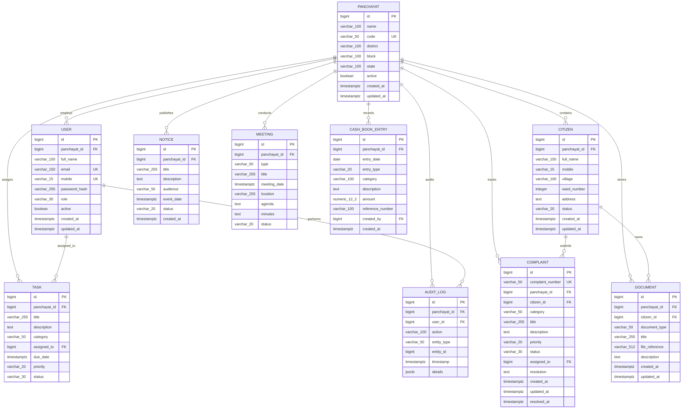

# GRAMAI — Database Schema & Data Modeling Specification

> **Database Engine**: PostgreSQL 16  
> **ORM Engine**: Hibernate 6 / Spring Data JPA  
> **Naming Convention**: `snake_case` for tables and columns, singular table names  

---

## 1. Entity-Relationship Diagram (ERD)



---

## 2. Table Schema Specifications

### 2.1 `panchayat`
Represents a Gram Panchayat administrative unit.

| Column | Type | Constraints | Description |
| :--- | :--- | :--- | :--- |
| `id` | `BIGSERIAL` | `PRIMARY KEY` | Unique identifier |
| `name` | `VARCHAR(100)` | `NOT NULL` | Name of the Gram Panchayat |
| `code` | `VARCHAR(50)` | `NOT NULL, UNIQUE` | LGD / Official code |
| `district` | `VARCHAR(100)` | `NOT NULL` | District name |
| `block` | `VARCHAR(100)` | `NOT NULL` | Janpad / Block name |
| `state` | `VARCHAR(100)` | `NOT NULL` | State name |
| `active` | `BOOLEAN` | `NOT NULL DEFAULT true` | Soft-deactivation flag (preserves relational integrity) |
| `created_at` | `TIMESTAMPTZ` | `NOT NULL` | System creation timestamp |
| `updated_at` | `TIMESTAMPTZ` | `NOT NULL` | System update timestamp |

### 2.2 `users`
System user accounts mapped to specific roles and Gram Panchayats.

| Column | Type | Constraints | Description |
| :--- | :--- | :--- | :--- |
| `id` | `BIGSERIAL` | `PRIMARY KEY` | Unique identifier |
| `panchayat_id` | `BIGINT` | `REFERENCES panchayat(id)` | Associated Panchayat |
| `full_name` | `VARCHAR(150)` | `NOT NULL` | User's full name |
| `email` | `VARCHAR(150)` | `NOT NULL, UNIQUE` | User email address |
| `mobile` | `VARCHAR(15)` | `NOT NULL, UNIQUE` | Mobile phone number |
| `password_hash`| `VARCHAR(255)` | `NOT NULL` | BCrypt password hash |
| `role` | `VARCHAR(30)` | `NOT NULL` | `ADMIN`, `SECRETARY`, `SARPANCH`, `GRS`, `PANCH`, `CITIZEN` |
| `active` | `BOOLEAN` | `NOT NULL DEFAULT true` | Account active flag |
| `created_at` | `TIMESTAMPTZ` | `NOT NULL` | System creation timestamp |
| `updated_at` | `TIMESTAMPTZ` | `NOT NULL` | System update timestamp |

### 2.3 `citizens`
Master directory of village residents for each Gram Panchayat.

> **Architectural Decisions**:
> 1. **Soft Deactivation (`status`)**: Physical deletion is prohibited by default. Inactive or archived citizens are marked with `status = 'INACTIVE'`. This preserves historical integrity and foreign key relations for future complaints, document records, certificates, and welfare applications.
> 2. **Shared Contact Numbers**: Rural families frequently share a single mobile number across family members. Consequently, no hard unique constraint is enforced on `mobile`, but duplicate warnings are surfaced to operators.
> 3. **Non-Sensitive Identification**: Sensitive identifiers such as Aadhaar numbers are intentionally excluded from the registry.

| Column | Type | Constraints | Description |
| :--- | :--- | :--- | :--- |
| `id` | `BIGSERIAL` | `PRIMARY KEY` | Unique identifier |
| `panchayat_id` | `BIGINT` | `NOT NULL, REFERENCES panchayat(id)` | Associated Panchayat (multi-tenant boundary) |
| `full_name` | `VARCHAR(150)` | `NOT NULL` | Citizen's full name (supports Hindi & regional Unicode) |
| `mobile` | `VARCHAR(15)` | `NULL` | Contact phone number (optional) |
| `village` | `VARCHAR(100)` | `NOT NULL` | Village name / Hamlet |
| `ward_number` | `INTEGER` | `NOT NULL` | Ward number (1-999) |
| `address` | `TEXT` | `NULL` | Full residential address |
| `status` | `VARCHAR(20)` | `NOT NULL DEFAULT 'ACTIVE'` | Status flag (`ACTIVE`, `INACTIVE`) |
| `created_at` | `TIMESTAMPTZ` | `NOT NULL` | System creation timestamp |
| `updated_at` | `TIMESTAMPTZ` | `NOT NULL` | System update timestamp |

### 2.4 `complaints`
Grievance logs submitted by citizens or staff, isolated strictly per Gram Panchayat.

> **Architectural Decisions**:
> 1. **Human-Readable Complaint Number (`complaint_number`)**: Unique format `CMP-YYYY-XXXXXX` (e.g. `CMP-2026-000001`). Generated authoritatively server-side using current year and count within the year. Never derived from raw database IDs and client-provided numbers are strictly rejected.
> 2. **Tenant Integrity**: The complainant `citizen_id` and assignee `assigned_to` must strictly belong to the same `panchayat_id`. Cross-Panchayat references are rejected.
> 3. **Controlled Status Workflow**: Transitions between statuses (`OPEN`, `IN_PROGRESS`, `WAITING`, `RESOLVED`, `CLOSED`, `REJECTED`) are strictly controlled by a state machine.
> 4. **Mandatory Resolution**: Transitions to `RESOLVED` or `CLOSED` require a non-empty resolution note.

| Column | Type | Constraints | Description |
| :--- | :--- | :--- | :--- |
| `id` | `BIGSERIAL` | `PRIMARY KEY` | Unique internal identifier |
| `complaint_number`| `VARCHAR(50)` | `NOT NULL, UNIQUE` | Human-readable searchable ID (e.g. `CMP-2026-000001`) |
| `panchayat_id` | `BIGINT` | `NOT NULL, REFERENCES panchayats(id)` | Tenant boundary |
| `citizen_id` | `BIGINT` | `NOT NULL, REFERENCES citizens(id)` | Complainant citizen |
| `category` | `VARCHAR(50)` | `NOT NULL` | `WATER`, `SCHOOL`, `ROAD`, `SANITATION`, `HEALTH`, `ANGANWADI`, `MGNREGA`, `HOUSING`, `STREET_LIGHT`, `OTHER` |
| `title` | `VARCHAR(255)` | `NOT NULL` | Brief title |
| `description` | `TEXT` | `NOT NULL` | Detailed complaint narrative |
| `priority` | `VARCHAR(20)` | `NOT NULL DEFAULT 'MEDIUM'` | `LOW`, `MEDIUM`, `HIGH`, `URGENT` |
| `status` | `VARCHAR(30)` | `NOT NULL DEFAULT 'OPEN'` | `OPEN`, `IN_PROGRESS`, `WAITING`, `RESOLVED`, `CLOSED`, `REJECTED` |
| `assigned_to` | `BIGINT` | `NULL, REFERENCES users(id)` | Assigned Panchayat official |
| `resolution` | `TEXT` | `NULL` | Formal resolution narrative |
| `created_at` | `TIMESTAMPTZ` | `NOT NULL` | Creation timestamp |
| `updated_at` | `TIMESTAMPTZ` | `NOT NULL` | Last update timestamp |
| `resolved_at` | `TIMESTAMPTZ` | `NULL` | Timestamp when marked as resolved |

### 2.5 `complaint_history`
Append-only activity and audit log for individual complaints tracking lifecycle events, status transitions, assignments, and resolution notes.

| Column | Type | Constraints | Description |
| :--- | :--- | :--- | :--- |
| `id` | `BIGSERIAL` | `PRIMARY KEY` | Unique history record ID |
| `complaint_id` | `BIGINT` | `NOT NULL, REFERENCES complaints(id) ON DELETE CASCADE` | Complaint parent record |
| `action` | `VARCHAR(50)` | `NOT NULL` | Event type (`CREATED`, `STATUS_CHANGED`, `ASSIGNED`, `RESOLVED`, `CLOSED`, `UPDATED`) |
| `from_status` | `VARCHAR(30)` | `NULL` | Status before change |
| `to_status` | `VARCHAR(30)` | `NULL` | Status after change |
| `performed_by` | `BIGINT` | `NOT NULL, REFERENCES users(id)` | User who executed the action |
| `performed_by_name`| `VARCHAR(150)`| `NULL` | Denormalized user name at event time |
| `performed_by_role`| `VARCHAR(50)` | `NULL` | Role at event time (`SECRETARY`, `ADMIN`, etc.) |
| `details` | `TEXT` | `NULL` | Descriptive explanation, notes, or remarks |
| `created_at` | `TIMESTAMPTZ` | `NOT NULL` | Event timestamp |

### 2.6 `documents`
Indexed file references for uploaded documents.

| Column | Type | Constraints | Description |
| :--- | :--- | :--- | :--- |
| `id` | `BIGSERIAL` | `PRIMARY KEY` | Unique identifier |
| `panchayat_id` | `BIGINT` | `NOT NULL, REFERENCES panchayats(id)` | Tenant boundary |
| `citizen_id` | `BIGINT` | `NULL, REFERENCES citizens(id)` | Associated citizen (optional) |
| `document_type` | `VARCHAR(50)` | `NOT NULL` | `RATION_CARD`, `SAMAGRA_DOC`, `JOB_CARD`, `CERTIFICATE`, `OTHER` |
| `title` | `VARCHAR(255)` | `NOT NULL` | Document label |
| `file_reference`| `VARCHAR(512)`| `NOT NULL` | Internal file storage reference key |
| `description` | `TEXT` | `NULL` | Notes or metadata |
| `created_at` | `TIMESTAMPTZ` | `NOT NULL` | Upload timestamp |
| `updated_at` | `TIMESTAMPTZ` | `NOT NULL` | Update timestamp |

### 2.7 `cash_book_entries`
Financial receipts and disbursements.

| Column | Type | Constraints | Description |
| :--- | :--- | :--- | :--- |
| `id` | `BIGSERIAL` | `PRIMARY KEY` | Unique identifier |
| `panchayat_id` | `BIGINT` | `NOT NULL, REFERENCES panchayats(id)` | Tenant boundary |
| `entry_date` | `DATE` | `NOT NULL` | Transaction date |
| `entry_type` | `VARCHAR(20)` | `NOT NULL` | `RECEIPT`, `EXPENSE` |
| `category` | `VARCHAR(100)` | `NOT NULL` | Fund category |
| `description` | `TEXT` | `NOT NULL` | Transaction details |
| `amount` | `NUMERIC(12,2)`| `NOT NULL` | Monetary value (`BigDecimal` in Java) |
| `reference_number`| `VARCHAR(100)`| `NULL` | Voucher / Receipt reference |
| `created_by` | `BIGINT` | `NOT NULL, REFERENCES users(id)` | Creator user |
| `created_at` | `TIMESTAMPTZ` | `NOT NULL` | System timestamp |

---

## 3. Database Performance & Multi-Tenant Indexing

To guarantee sub-second response times across large multi-tenant datasets, the following composite and single-column indexes are defined:

```sql
-- Multi-tenant Citizen Indexes
CREATE INDEX idx_citizen_panchayat_id ON citizens (panchayat_id);
CREATE INDEX idx_citizen_panchayat_mobile ON citizens (panchayat_id, mobile);
CREATE INDEX idx_citizen_panchayat_status ON citizens (panchayat_id, status);
CREATE INDEX idx_citizen_panchayat_village ON citizens (panchayat_id, village);
CREATE INDEX idx_citizen_panchayat_ward ON citizens (panchayat_id, ward_number);
CREATE INDEX idx_citizen_panchayat_created ON citizens (panchayat_id, created_at DESC);

-- Multi-tenant Complaint Indexes
CREATE INDEX idx_complaint_panchayat_id ON complaints (panchayat_id);
CREATE INDEX idx_complaint_number ON complaints (complaint_number);
CREATE INDEX idx_complaint_status ON complaints (status);
CREATE INDEX idx_complaint_category ON complaints (category);
CREATE INDEX idx_complaint_priority ON complaints (priority);
CREATE INDEX idx_complaint_citizen_id ON complaints (citizen_id);
CREATE INDEX idx_complaint_assigned_to ON complaints (assigned_to);
CREATE INDEX idx_complaint_created_at ON complaints (created_at DESC);
CREATE INDEX idx_complaint_panchayat_status ON complaints (panchayat_id, status);
CREATE INDEX idx_complaint_panchayat_created ON complaints (panchayat_id, created_at DESC);

-- Complaint Activity History Indexes
CREATE INDEX idx_complaint_history_complaint ON complaint_history (complaint_id);
CREATE INDEX idx_complaint_history_created ON complaint_history (created_at ASC);
```
