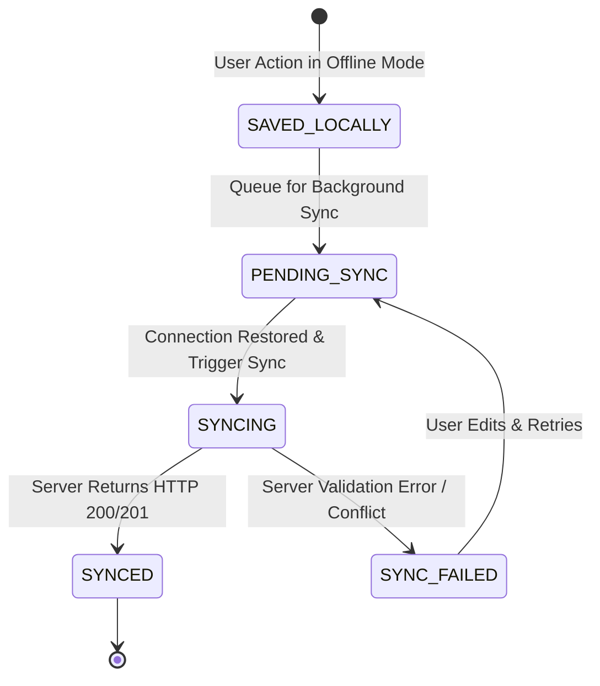

# GRAMAI — Offline-First Architecture Strategy

> **Document Version**: 1.0.0  
> **Status**: Architectural Foundation (Full Sync Engine targeted for Milestone 12)  

---

## 1. Guiding Philosophy & Non-Negotiable Rule

In rural Panchayat operations, intermittent internet connectivity is a daily reality. However, financial and administrative integrity mandates a single non-negotiable rule:

> ⚠️ **The Integrity Rule**: GramAI will NEVER falsely report that an official transaction (e.g. cash entry, official certificate issue, or government submission) has completed successfully until the server explicitly confirms it.

Local saves are explicitly labeled as **Draft / Pending Sync** until server verification is achieved.

---

## 2. Record Lifecycle & Synchronization Workflow



### 2.1 Record Status Definitions
1. `SAVED_LOCALLY`: The record resides safely in the browser client's local IndexedDB database. It is visible on the user's dashboard with a distinct **"Saved Locally"** badge.
2. `PENDING_SYNC`: The application is actively attempting or waiting for an active internet connection to push the queue to the backend.
3. `SYNCED`: The Spring Boot server has received, validated, and persisted the record to PostgreSQL. Server-assigned fields (e.g. `id`, `complaint_number`, `created_at`) are updated in local storage.
4. `SYNC_FAILED`: The server rejected the record (e.g. duplicate mobile number or validation failure). The user receives an actionable error alert to fix the data before retrying.

---

## 3. Client Architecture & IndexedDB Storage Model (Milestone 12 Foundation)

When full offline support is activated in Milestone 12, the frontend application will integrate Service Workers and IndexedDB (via `idb` or `Dexie.js`):

```
┌─────────────────────────────────────────────────────────┐
│                    React UI Components                  │
└────────────────────────────┬────────────────────────────┘
                             │
                             v
┌─────────────────────────────────────────────────────────┐
│                  TanStack Query + Axios                 │
│              (Network Interceptor Layer)                │
└──────────────┬───────────────────────────┬──────────────┘
               │ (Online)                  │ (Offline)
               v                           v
┌──────────────────────────┐    ┌──────────────────────────┐
│   Spring Boot REST API   │    │     IndexedDB Store      │
│   (PostgreSQL Server)    │    │ (Local Offline Cache)    │
└──────────────────────────┘    └──────────────────────────┘
```

### 3.1 Pending Sync Queue Schema
Local requests that cannot reach the server are queued in an IndexedDB table named `pending_sync_queue`:

```typescript
interface PendingSyncRecord {
  localId: string;           // UUID v4 generated on client
  entityType: string;        // 'COMPLAINT' | 'CITIZEN' | 'CASH_ENTRY'
  action: 'CREATE' | 'UPDATE' | 'DELETE';
  payload: Record<string, any>;
  timestamp: number;         // Client creation timestamp
  status: 'PENDING' | 'FAILED';
  errorMessage?: string;
}
```

---

## 4. Conflict Resolution Strategy

1. **Server Timestamp Authority**: The backend server is the ultimate source of truth. When synchronizing local changes, server-side timestamps override client-side clocks.
2. **Optimistic Locking**: Entities susceptible to concurrent edits carry a `version` field. If a record has been modified on the server while client was offline, a conflict response is returned requiring manual merge review.
3. **Idempotent API Endpoints**: Synchronizing requests pass client-generated `X-Idempotency-Key` headers (UUID) to prevent duplicate record insertion if network drops mid-response.

---

## 5. MVP Scope Boundaries for Offline Support

For the current MVP build (Milestones 1–11):
- Frontend components implement network state awareness hooks (`useNetworkStatus`).
- UI displays clear status badges ("Connected", "Offline Mode").
- Axios API interceptors capture connection drops gracefully, presenting informative Hindi error banners instead of crashing.
- Data structures are designed with client-side UUID fields to enable seamless sync queue onboarding in Milestone 12.
