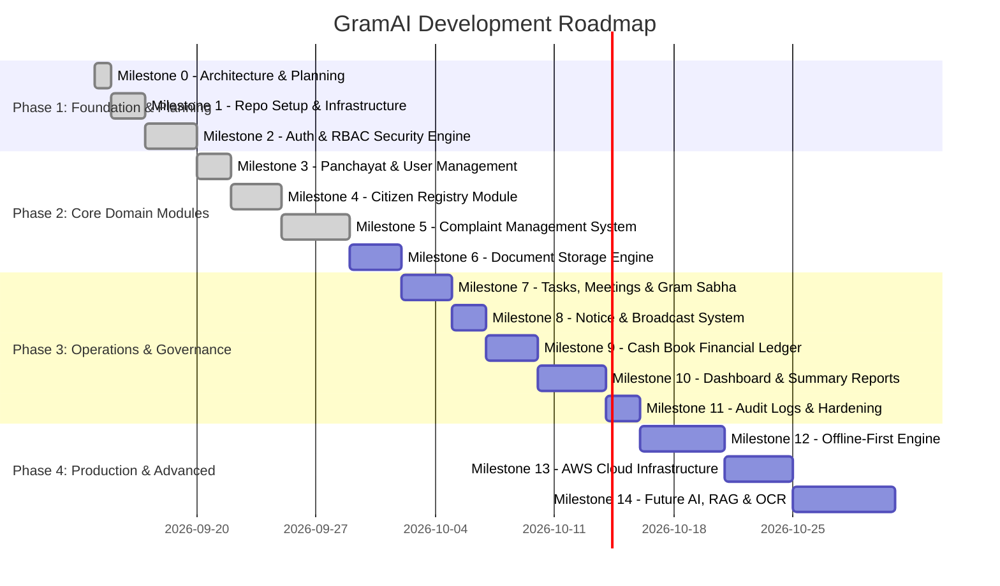

# GRAMAI — Development Roadmap & Milestone Schedule

> **Execution Standard**: Step-by-Step Phased Engineering  
> **Rule**: No milestone begins until the preceding milestone passes all verification tests and receives explicit approval.  

---

## 🗺️ Milestone Roadmap Overview

---

## 📋 Detailed Milestone Breakdown

### Milestone 0: Architecture & Detailed Planning
- **Status**: ✅ **COMPLETED**
- **Deliverables**:
  - Full codebase repository inspection.
  - Creation of master documentation suite in `docs/`: `PROJECT_PLAN.md`, `ARCHITECTURE.md`, `DATABASE.md`, `API.md`, `SECURITY.md`, `OFFLINE_STRATEGY.md`, `ROADMAP.md`, and top-level `README.md`.
  - Defined modular monolith package structures, entity data models, security parameters, and API standard envelopes.

---

### Milestone 1: Repository Setup & Infrastructure Scaffolding
- **Status**: ✅ **COMPLETED**
- **Deliverables**:
  - Scaffold React 18 + TypeScript + Vite + Tailwind CSS frontend application (`frontend/`).
  - Scaffold Java 21 + Spring Boot 3.3 Maven backend application (`backend/`).
  - Configure `docker-compose.yml` with backend, frontend, and PostgreSQL 16 services.
  - Setup `.env.example` and comprehensive `.gitignore` files.
  - Implemented health check endpoint `GET /api/v1/health`.
  - Implemented frontend status verification page and application shell.
  - Verified backend and frontend test suites and production builds.

---

### Milestone 2: Authentication, JWT & RBAC Engine
- **Status**: ✅ **COMPLETED**
- **Deliverables**:
  - Implemented Spring Security 6 stateless filter chain with custom `JwtAuthenticationFilter`.
  - Implemented HMAC-SHA512 JWT generation, validation, and claim extraction (`JwtUtils`).
  - Implemented BCrypt password hashing service with work factor 12.
  - Implemented custom `UserDetailsService` and `CustomUserPrincipal`.
  - Built Auth REST controller (`POST /api/v1/auth/login`, `GET /api/v1/auth/me`).
  - Built RBAC testing controller (`/api/v1/test/admin`, `/api/v1/test/secretary`, `/api/v1/test/citizen`).
  - Added clean JSON error handling (`JwtAuthenticationEntryPoint`, `JwtAccessDeniedHandler`).
  - Created development data seeder (`DevDataSeeder`) provisioning demo Panchayat and 6 test role accounts + inactive account.
  - Built React Auth context (`AuthContext`, `useAuth`), route guard (`ProtectedRoute`), responsive `LoginPage`, and header session controls.
  - Automated tests: 17 backend JUnit tests + 9 frontend Vitest tests passing 100%.

---

### Milestone 3: Panchayat & User Management
- **Status**: ✅ **COMPLETED**
- **Deliverables**:
  - Implemented `Panchayat` entity with soft deactivation (`active` status flag) and automatic timestamp management.
  - Implemented `User` domain with secure BCrypt temporary password provisioning and strict credential non-exposure (`passwordHash` never leaked).
  - Built comprehensive REST APIs: `/api/v1/panchayats` (CRUD) and `/api/v1/users` (CRUD + Status PATCH).
  - Enforced authoritative server-side multi-tenant isolation: non-ADMIN users cannot access, query, or mutate records outside their assigned Panchayat (terminating in `403 Forbidden`).
  - Implemented pagination and case-insensitive keyword search for both Panchayats and Users.
  - Built responsive React UI for Panchayat Directory (`PanchayatsPage`) and User Management (`UsersPage`) with role-aware controls.
  - Automated tests: 42 backend JUnit tests + 17 frontend Vitest tests passing 100%.

---

### Milestone 4: Citizen Registry Module
- **Status**: ✅ **COMPLETED**
- **Deliverables**:
  - Implemented `Citizen` JPA entity with multi-tenant `panchayat_id` foreign key, `ACTIVE`/`INACTIVE` status lifecycle, Hindi/Unicode name support, and composite indexes.
  - Built comprehensive REST APIs: `/api/v1/citizens` (CRUD, Search, Filter, Pagination, Whitelisted Sorting, and Status PATCH).
  - Enforced strict server-side multi-tenant Panchayat isolation (cross-Panchayat lookups and query manipulations return `403 Forbidden`).
  - Implemented privacy protection: `CITIZEN` user role is strictly prevented from inspecting registry directory (`403 Forbidden`).
  - Added sensible duplicate handling: allows family members to share mobile numbers without 409 conflicts while surfacing informative notices.
  - Built responsive React UI: Citizen Registry directory (`/citizens`), Add Citizen form with Hindi labels and live validation (`/citizens/new`), and Citizen Details view with in-place edit modal and future module placeholders (`/citizens/:id`).
  - Automated tests: 61 backend JUnit tests + 28 frontend Vitest tests passing 100%.

---

### Milestone 5: Complaint Management System
- **Status**: ✅ **COMPLETED**
- **Deliverables**:
  - Implemented `Complaint` entity with server-generated unique human-readable complaint numbers (`CMP-YYYY-XXXXXX`), audit timestamps, and composite indexing.
  - Implemented `ComplaintHistory` entity recording comprehensive event logs for complaint creation, assignment, status transition, resolution, and closure.
  - Built controlled backend state machine preventing arbitrary jumps (`OPEN` → `IN_PROGRESS`/`REJECTED`, `IN_PROGRESS` → `WAITING`/`RESOLVED`, `WAITING` → `IN_PROGRESS`/`RESOLVED`, `RESOLVED` → `CLOSED`/`IN_PROGRESS`, terminal `CLOSED` & `REJECTED`).
  - Enforced mandatory resolution requirement: cannot mark as `RESOLVED` without a resolution note, and cannot mark as `CLOSED` without existing verified resolution.
  - Enforced strict server-side Panchayat multi-tenant isolation and RBAC: non-ADMIN users cannot access complaints, citizens, or assignees outside their assigned Panchayat (`403 Forbidden`).
  - Built 9 comprehensive REST endpoints: `/api/v1/complaints` (CRUD, Multi-Filter, Search, Pagination, Whitelisted Sorting), `/summary`, `/status`, `/assign`, `/resolve`, `/close`, and `/history`.
  - Built responsive React UI: Complaint directory (`/complaints`), New Complaint registration with Citizen Registry picker (`/complaints/new`), and Comprehensive Complaint Detail view with live state transition modals, resolution logging, staff assignment, and timeline (`/complaints/:id`).
  - Automated tests: 79 backend JUnit tests (including 18 Complaint tests) + 38 frontend Vitest tests (including 10 Complaint tests) passing 100%.

---

### Milestone 6: Document Storage & Management System
- **Deliverables**:
  - Implement `StorageService` interface with `LocalStorageService` implementation.
  - Implement `DocumentRecord` entity linked to citizens and Panchayats.
  - File upload UI component with format/size validation.

---

### Milestone 7: Tasks, Meetings & Gram Sabha Module
- **Deliverables**:
  - Implement `Task` and `Meeting` domain logic.
  - Gram Sabha meeting scheduler and minute recording view.
  - Internal staff task checklist and priority assignment board.

---

### Milestone 8: Notice Board & Broadcast System
- **Deliverables**:
  - Implement `Notice` entity and category filters.
  - Build public village notice board screen.
  - Setup `NotificationProvider` abstraction for future SMS/WhatsApp integrations.

---

### Milestone 9: Cash Book Financial Ledger
- **Deliverables**:
  - Implement `CashBookEntry` entity using `NUMERIC(12,2)` / `BigDecimal`.
  - Financial ledger table with Receipt and Expense totals calculation.
  - Voucher/Receipt reference tracking and monthly cash flow summary view.

---

### Milestone 10: Secretary Dashboard & Reporting Engine
- **Deliverables**:
  - Hindi-friendly, mobile-first Secretary Dashboard UI with key metrics cards.
  - Quick action buttons (Add Citizen, Log Complaint, Upload Document, Cash Entry).
  - Analytical reports with summary exports.

---

### Milestone 11: System Audit Logging & Security Hardening
- **Deliverables**:
  - AOP Aspect logging for user actions to `audit_logs` table.
  - Security audit, CORS origin restriction, and headers verification.
  - Full end-to-end automated test suite execution (JUnit + Vitest).

---

### Milestone 12: Offline-First Architectural Foundation & Sync Engine
- **Deliverables**:
  - Integrate PWA Service Worker and IndexedDB client cache (`idb`).
  - Build background offline sync queue (`pending_sync_queue`).
  - Conflict resolution and status synchronization badges (`SAVED_LOCALLY`, `SYNCED`).

---

### Milestone 13: AWS Cloud Infrastructure & CI/CD Pipeline
- **Deliverables**:
  - AWS ECS / EC2 deployment configurations with RDS PostgreSQL.
  - AWS S3 integration for `S3StorageService`.
  - GitHub Actions CI/CD workflow for automated test and build validation.

---

### Milestone 14: Future AI, RAG & OCR Scheme Assistant
- **Deliverables**:
  - Integrate AWS Bedrock / Textract for document OCR parsing.
  - RAG pipeline over official government circulars and scheme guidelines.
  - Natural language search interface for Panchayat records.
